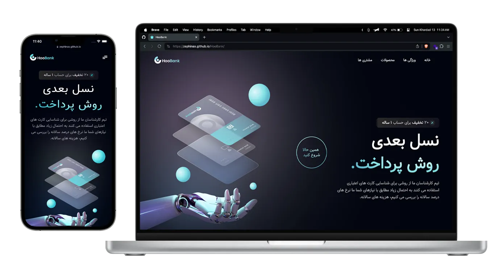

# HooBank - Business Website Template



### ⚠️ **All names, information and assets used are fake and do not represent a real componany.** ⚠️

## Live Demo

### Take a look the live demo here 👉 [Zephinax.HooBank.ir](https://zephinax.github.io/HooBank/)

Modern landing, Expertly developed using React and Tailwind CSS. visually stunning and intuitive interface that redefines the standard of modern web design

## Layout

- Header
- Hero section
- Features section
- Billing section
- Product showcase section
- Testimonials section
- Clients section
- Call to action section
- Footer

## Built With

- React.js
- Tailwind CSS
- Vite

## How to install

1. Clone this repository:

```bash
git clone https://github.com/Zephinax/HooBank.git
```

2. Go into project

```bash
cd HooBank
```

3. Install dependencies

```bash
npm install
```

4. Run project

```bash
npm run dev
```

Give a ⭐ if you like this project!

## Authors

- [@Zephinax](https://github.com/Zephinax)

  Please give me proper credit by linking back to [Me](https://github.com/Zephinax), Thanks!
